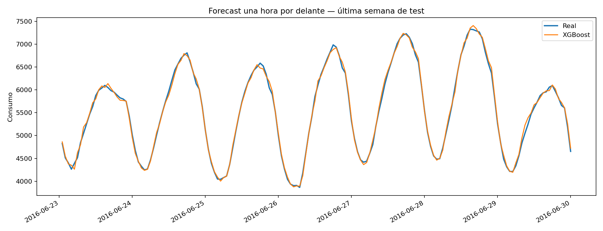
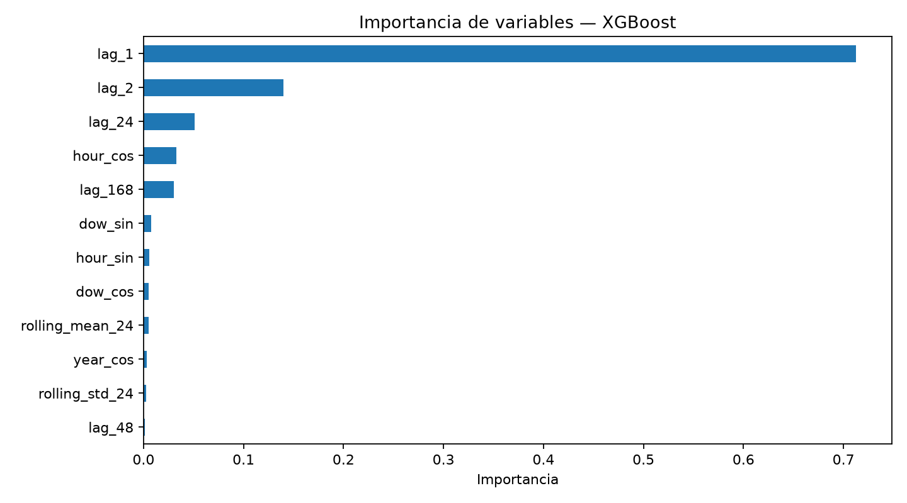
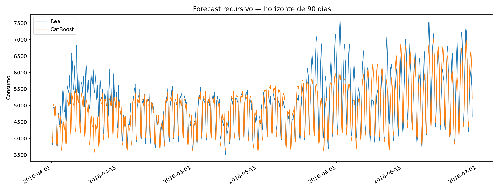

# Energy Forecasting with XGBoost & CatBoost

Proyecto reproducible para analizar el comportamiento del consumo por hora y comparar XGBoost y CatBoost con referencias ingenuas. Incluye un forecast rolling de una hora y una extensión recursiva de 90 días.

Este repositorio demuestra preparación de series temporales, prevención de fuga de información, validación cronológica y comunicación de métricas. El caso no utiliza información financiera, pero las mismas decisiones metodológicas son aplicables a forecasting de demanda, cobros o tesorería.

## Pregunta analítica

> ¿Qué patrones presenta el consumo horario y con qué precisión pueden anticiparse la siguiente hora y un horizonte continuo de tres meses?

El proyecto separa dos usos que no deben confundirse:

- **Una hora por delante:** cada nueva predicción puede usar el último consumo real observado.
- **90 días:** solo se conocen los datos anteriores al inicio; después, los modelos reutilizan sus propias predicciones y acumulan error.

Ambos resultados mantienen frecuencia horaria. No se extrapola hasta 2018 porque un horizonte tan largo sin variables exógenas no quedaba validado por los datos disponibles.

## Datos

El archivo `data/energy_train.csv` contiene 124.870 registros horarios entre abril de 2002 y junio de 2016. El proceso reproducible:

- ordena cronológicamente;
- conserva una observación en cada marca temporal duplicada;
- reconstruye una rejilla horaria completa;
- interpola 28 huecos internos;
- valida que no queden valores ausentes ni consumos no positivos.

La fuente original y la unidad física no están documentadas en el material de partida. Por eso el proyecto habla de **unidades de consumo** y declara esta carencia como una limitación, en lugar de atribuir al dato una procedencia o unidad no verificadas.

## Análisis del comportamiento

El notebook estudia antes de modelizar:

- evolución del consumo medio diario y tendencia anual móvil;
- patrón medio según la hora del día;
- diferencias por día de la semana y mes;
- detalle de ciclos horarios en periodos cortos;
- contraste ADF, interpretado sin confundir estacionariedad estadística con ausencia de estacionalidad.

## Prevención de fuga de información

Las variables predictoras son:

- retardos de 1, 2, 24, 48 y 168 horas;
- media y desviación móvil de 24 y 168 horas;
- ciclos horarios, semanales y anuales codificados con seno y coseno.

Las estadísticas móviles se calculan sobre `Energy.shift(1)`. Así, el valor real de la hora que se intenta estimar no interviene en sus propias variables. La división también es estrictamente temporal:

| Conjunto | Periodo |
|---|---|
| Entrenamiento | abril de 2002 — diciembre de 2015 |
| Test final | enero de 2016 — junio de 2016 |

## Resultados reproducidos: una hora

Resultados obtenidos ejecutando `python run_analysis.py`:

| Modelo | MAE | RMSE | WAPE |
|---|---:|---:|---:|
| XGBoost | 50,21 | 65,77 | 0,91 % |
| CatBoost | 50,13 | 65,83 | 0,91 % |
| Persistencia (1 hora) | 153,79 | 199,06 | 2,78 % |
| Referencia semanal (168 horas) | 602,93 | 827,00 | 10,91 % |

XGBoost obtiene el menor RMSE y CatBoost el menor MAE, pero la diferencia entre ambos es pequeña. La conclusión defendible es que ambos superan ampliamente las referencias en este test; no que uno sea universalmente mejor.





## Extensión reproducida: 90 días

Se reservan las últimas 2.160 horas de la serie. Durante ese periodo no se incorporan consumos reales a los retardos ni a las medias móviles:

| Modelo | MAE | RMSE | WAPE |
|---|---:|---:|---:|
| CatBoost | 304,08 | 450,87 | 5,98 % |
| XGBoost | 347,76 | 518,99 | 6,85 % |
| Referencia semanal | 541,25 | 753,41 | 10,65 % |
| Persistencia | 885,20 | 1.125,22 | 17,42 % |

CatBoost conserva mejor los ciclos horarios y supera las referencias, pero suaviza algunos picos. La pérdida de precisión frente al forecast de una hora cuantifica el coste real de ampliar el horizonte sin temperatura, festivos u otras variables explicativas.



## Estructura

```text
.
├── data/energy_train.csv              # Serie histórica incluida
├── notebooks/energy_forecasting.ipynb # Recorrido analítico reproducible
├── reports/generated/                 # Métricas, predicciones y figuras
├── src/
│   ├── data.py                        # Calidad y regularización horaria
│   ├── features.py                    # Variables estrictamente causales
│   ├── evaluation.py                  # Split, referencias y métricas
│   ├── modeling.py                    # Configuración de modelos
│   └── recursive.py                   # Forecast multi-step sin datos futuros
├── tests/                              # Controles de datos y leakage
└── run_analysis.py                     # Ejecución completa por CLI
```

## Instalación y ejecución

Probado con Python 3.11. Python 3.12 también es compatible con las dependencias declaradas.

```bash
python -m venv .venv
source .venv/bin/activate           # Linux/macOS
# .\.venv\Scripts\Activate.ps1    # Windows PowerShell

python -m pip install --upgrade pip
python -m pip install -r requirements.txt
python run_analysis.py
```

Para abrir el análisis narrativo:

```bash
python -m jupyter notebook notebooks/energy_forecasting.ipynb
```

## Pruebas

```bash
python -m pip install -r requirements-dev.txt
python -m pytest -q
```

Las ocho pruebas comprueban la limpieza de duplicados y huecos, la división cronológica, las métricas, la construcción causal de variables y que el forecast largo reutiliza sus propias predicciones. GitHub Actions las ejecuta en cada Pull Request.

## Limitaciones

- La procedencia y unidad de la serie original no están verificadas.
- El forecast de 90 días es recursivo y acumula sus propios errores.
- No se utilizan variables exógenas como temperatura, festivos o actividad económica.
- Un despliegue real requeriría monitorización del error, detección de deriva y una política de reentrenamiento.
- Los resultados no deben extrapolarse a horizontes superiores a los 90 días evaluados.

## Autor

Jorge Galán Rodríguez — [GitHub](https://github.com/jorgegalanr)

## Licencia

MIT.
